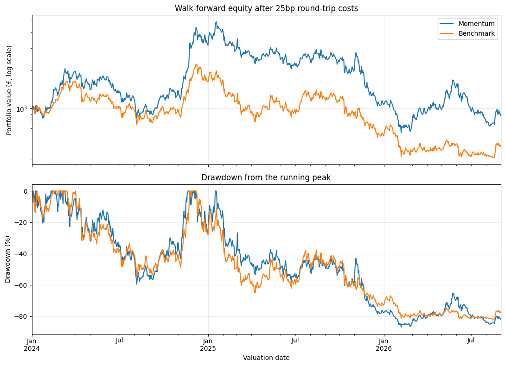

# Crypto cross-sectional momentum

**Bitcoin filter chosen for implementation, standard is not**

The annually selected 90d momentum rule, holding the top 10% of eligible assets and rebalancing weekly, returned -10.11% after modelling transaction costs (25bp round trip) over 01/2024-08/2026. The equal-weight benchmark (rebalanced to equal weight weekly) returned -48.68%. However, the strategy had greater volatility, a worse maximum drawdown, and a 95% Sharpe-difference interval that included zero. Hence no statistically significant edge over the benchmark has been shown. This does not prove that no advantage exists, but that the test is inconclusive.

Previous project only considered BTC/ETH, so universe is broader here, but limited by a currently live asset universe, proxy execution prices and a short evaluation period.

## Economic hypothesis

The question we seek to answer is, can ranking cryptocurrencies by recent returns improve performance compared to holding the same eligible universe with equal weights?

The economic hypothesis is that gradual changes in investor demand can sustain relative price trends, so recent winners may continue to outperform their counterparts. This is the economic motivation behind testing, and is not a reason why this strategy must work.

## Strategy

At midnight (UTC) Monday, each eligible's assets trailing (close to close) returns are calculated using daily candles. They are then ranked, and the top fraction are selected and given equal weight in the order. Round the number of selected assets upwards. For example, selecting the top 10% of 27 assets gives three holdings, each with a target weight of one third.

This is cross-sectional momentum. Unlike the previous BTC/ETH project, returns are ranked against other assets, as opposed to against zero. Negative-momentum winners can still be chosen. Both portfolios hold cash when fewer than 20 assets qualify, else they are fully invested. Weights drift between rebalances.

The benchmark holds all assets in the same eligible universe with equal weights, using the same decision and rebalance schedule.

Begin with 30d momentum and a top fraction of 20% when checking the implementation. The subsequent sweep tests 7, 14, 30, 60, 90 and 180 days, with top fractions of 10%, 20% and 30%. Annual selection chooses 90d momentum and the top 10% in all three evaluation folds.

## Assumptions

- Universe: saved (current) Revolut UK GBP candidate catalogue, matched to Coinbase USD products for data availability. Stablecoins and gold-backed tokens are excluded, alongside 'memecoins'. Historical survivor and selection bias remain due to universe being current.
- History: Coinbase Exchange daily USD candles, 01/01/2019-31/08/2026. There are 59 products before meme exclusions, with different listing dates.
- Eligibility: For a cryptocurrency to be eligibie, the following is required. 181 consecutive daily observations, at least $1m median daily volume over the previous 30 days, and at most the 30 most liquid eligible cryptocurrencies. At least 20 cryptocurrencies must qualify. History restarts after gaps, inclusive of XRP's 904 missing days.
- Execution: targets are fixed at Monday midnight. Use the first common time from 00:05, with the latest completed positive-volume minute candle for each targetted cryptocurrency. Its start must be no more than five minutes old. There were 16 delayed dates in the complete execution plan, with execution no later than 00:20.
- GBP valuation: divide USD prices by USD per GBP. Saved ECB rates are assumed available from the following midnight and carried through weekends, with a seven-day age limit.
- Transaction costs: 9bp commission plus 3.5bp other execution costs per side, giving 25bp round trip. These are modelling assumptions for (intended) Revolut X usage. Sensitivities use 40 and 60bp round trips. Costs apply to net assets bought or sold.
- Portfolio: fractional units allowed, no leverage or shorting, no interest on GBP cash and no forced final liquidation. Units and cash carry through year boundaries.
- Venue limitation: Coinbase last-trade references and ECB currency rates proxy GBP execution. Specific transaction fees unknown, hence why modelling assumptions used. Timing choices were informed by data availability checks across the sample.

## Research design

1. Save the data and audit timestamps, request boundaries, prices, volume and gaps.
2. Build history, liquidity and meme-exclusion rules, before looking at the momentum rankings and target weights.
3. Verify the portfolio ledger, execution timing and accounting before evaluating returns.
4. Perform parameter sweep across 18 configurations over 2022-2023. Select by the Sharpe difference against its matched benchmark. Ties favour lower turnover, then shorter lookback, then smaller top fraction.
5. Repeat selection annually using expanding training windows: 2022-2023 for 2024, 2022-2024 for 2025, and 2022-2025 for 01-08/2026. This is an expanding walk-forward with training-only selection.
6. Run one continuous evaluation portfolio, starting both the strategy and benchmark with £1,000 cash on 01/01/2024, including entry costs. Keep holdings through year boundaries. There are 974 daily returns, with the last close valued on 01/09/2026.
7. Estimate Sharpe difference uncertainty using a paired circular block bootstrap of daily net returns (10,000 resamples, 28-day blocks and 95% percentile intervals), with 14 and 56 block days as sensitivities.
8. Test sensitivity of strategy to round-trip transaction costs at 40 and 60bp, retaining the parameter choices made at lower transaction fees.

The [frozen protocol](research/weekly_sweep_protocol_v1.json) requires the primary Sharpe-difference interval's lower bound to be strictly positive. This was not shown. The bootstrap describes uncertainty in the realised portfolio comparison; it does not repeat parameter selection inside each resample or correct universe and execution biases.

These evaluation dates have now been examined, so cannot be reused as an untouched holdout for subsequent changes.

## Results

### First training period: 2022-2023

| Strategy | Total return | Sharpe | Maximum drawdown |
| --- | ---: | ---: | ---: |
| 90d / top 10%, chosen from the grid | 19.50% | 0.550 | -79.86% |
| Matched equal-weight benchmark | -58.29% | -0.280 | -79.58% |

Training winner outperformed its benchmark over the training period, despite a drawdown of ~80%. 

### Walk-forward: 2024-August 2026

| Strategy | Total return | CAGR | Annualised volatility | Sharpe | Maximum drawdown |
| --- | ---: | ---: | ---: | ---: | ---: |
| Annual momentum selection | -10.11% | -3.92% | 87.38% | 0.387 | -86dr9% |
| Matched equal-weight benchmark | -48.68% | -22.12% | 74.75% | 0.040 | -81.87% |

| Period | Momentum | Benchmark |
| --- | ---: | ---: |
| 2024 | 216.70% | 62.17% |
| 2025 | -65.99% | -62.51% |
| January-August 2026 | -16.54% | -15.59% |

Most of the positive results came in 2024, with similar performance in both 2025 and 2026 but momentum approach underperforming slighlty. The momentum approach also came with worse drawdown, and higher volatility.

### Significance testing

| Block length | Sharpe difference | 95% interval |
| --- | ---: | ---: |
| 28 days (primary) | +0.347 | [-0.359, +1.004] |
| 14 days (sensitivity) | +0.347 | [-0.323, +0.987] |
| 56 days (sensitivity) | +0.347 | [-0.409, +1.020] |

All intervals contain zero. Hence no statistically significant edge has been established, despite the relative outperformance. This does not prove that there is no edge, rather that the testing is inconclusive.

### Transaction costs

| Round-trip costs | Momentum return | Benchmark return | Momentum Sharpe | Benchmark Sharpe | Sharpe difference |
| --- | ---: | ---: | ---: | ---: | ---: |
| 25bp | -10.11% | -48.68% | 0.387 | 0.040 | +0.347 |
| 40bp | -15.14% | -49.24% | 0.362 | 0.035 | +0.328 |
| 60bp | -21.40% | -49.98% | 0.330 | 0.027 | +0.302 |

See that momentum still outperforms the benchmark at every cost level, but losses become larger. Commission stays fixed at 9bp per sides, but we scale other costs from 3.5bp to 11bp and 21bp per side. The strategy trades considerably more than the benchmark, so increasing costs hurts it more. This serves as a sensitivity test.

## Conclusion

The strategy produced much better cumulative returns than the matched benchmark, with the advantage maintaining across high transaction costs. However, both portfolios lost money over the holdout, the strategy was more volatile and had worse drawdown. The primary bootstrap significance test did not establish an edge. The result does not justify implementing this version as a proven edge, nor even a promising strategy.

## Bitcoin filter extension

**Strategy chosen for implementation**

The findings above concern the original unfiltered strategy. Now consider whether a Bitcoin filter can reduce exposure during unfavourable market conditions while retaining the same rule as above.

The economic hypothesis is that Bitcoin's trend can indicate wider cryptocurrency market conditions. Weakness in Bitcoin may accompany losses elsewhere, so holding cash during these periods could reduce drawdowns. This is a motivation for testing, rather than a guarantee that Bitcoin leads other cryptocurrencies or that a positive Bitcoin return means the market is safe.

### Filter rule

Keep 90d coin momentum, the top 10% of eligible assets, the universe rules and weekly rebalancing fixed. At Monday midnight (UTC), calculate Bitcoin's trailing return using completed daily BTC-USD closes. Hold the usual momentum portfolio only when this return is strictly positive. If it is zero or negative, hold all cash. The original cash rule when fewer than 20 assets qualify still applies.

Check the filter only at the Monday decision, with trade execution identical to before. A change in Bitcoin during the week does not trigger a trade.

### Development sweep and annual selection

Sweep Bitcoin lookbacks of 7, 14, 30, 60, 90, 120 and 180 calendar days. Select the highest net strategy Sharpe, rather than its Sharpe difference against equal weight.

| Bitcoin lookback | 2022-2023 return | Sharpe | Maximum drawdown |
| --- | ---: | ---: | ---: |
| 120d | 318.45% | 1.494 | -37.56% |
| 90d | 121.23% | 0.954 | -37.56% |
| 180d | 118.57% | 0.940 | -44.43% |
| 30d | 109.98% | 0.883 | -45.82% |
| 60d | 74.98% | 0.743 | -58.94% |
| 7d | 43.48% | 0.602 | -61.79% |
| Unfiltered | 19.50% | 0.550 | -79.86% |
| 14d | 9.92% | 0.406 | -65.09% |

See that 120d performs best in the first training period. Expanding training windows of 2022-2023, 2022-2024 and 2022-2025 all select 120d for their following evaluation periods. The large development return is a selection result.

### Evaluation: 2024-August 2026

Start each portfolio with £1,000 on 01/01/2024, testing through to 31/08/2026, giving 974 daily returns. Cash and units carry across year boundaries, with annual choices applied at the first scheduled Monday. Costs remain identical to before when trades are executed.

Apply the same selected Bitcoin filter to the equal-weight benchmark. This gives two different comparisons, filtered momentum vs unfiltered momentum, and filtered momentum vs filtered equal-weight

| Portfolio | Total return | CAGR | Sharpe | Maximum drawdown | Cash days |
| --- | ---: | ---: | ---: | ---: | ---: |
| Filtered momentum | 36.29% | 12.30% | 0.510 | -64.17% | 44.7% |
| Unfiltered momentum | -10.11% | -3.92% | 0.387 | -86.79% | 0.0% |
| Filtered equal weight | -55.20% | -25.99% | -0.199 | -75.60% | 44.7% |
| Unfiltered equal weight | -48.67% | -22.12% | 0.040 | -81.87% | 0.0% |

| Period | Filtered momentum | Unfiltered momentum |
| --- | ---: | ---: |
| 2024 | 117.51% | 216.70% |
| 2025 | -30.85% | -65.99% |
| January-August 2026 | -9.38% | -16.54% |

The filter sacrifices substantial gains in 2024, but avoids enough subsequent losses to finish ahead. Filtered momentum still loses money in 2025 and 01-08/2026, and its maximum drawdown remains ~64%. The worst drawdown had not recovered by the end of the evaluation.

Filtering equal weight reduces its total return, despite improving its maximum drawdown. Hence the filter does not improve every portfolio in this sample. Bitcoin being positive over the previous 120 days can also coincide with a market which has already started deteriorating.

### Transaction cost sensitivity

Now test transaction cost sensitivity across a variety of transaction costs per side. The portfolio execution remains identical, with only the transaction costs changing

| Total cost per side | Filtered momentum return | Unfiltered momentum return | Filtered Sharpe |
| --- | ---: | ---: | ---: |
| 0bp | 44.49% | -1.07% | 0.542 |
| 12.5bp, original assumption | 36.29% | -10.11% | 0.510 |
| 25bp | 28.55% | -18.33% | 0.479 |
| 50bp | 14.37% | -32.59% | 0.417 |
| 100bp | -9.49% | -54.09% | 0.292 |

See that filtered momentum remains positive at four times the original cost assumption, but loses money at 100bp per side, although this is unlikely to be the case in reality.

### Bootstrap comparisons

Use a standard bootstrap block comparison. 28 day blocks are the primary test, with others used as sensitivities. The primary comparison asks whether the Bitcoin filter improves momentum's Sharpe. A secondary comparison asks whether momentum selection improves Sharpe over equal weight when both use the same Bitcoin filter.

| Comparison | Block length | Sharpe difference | 95% interval |
| --- | --- | ---: | ---: |
| Filtered vs unfiltered momentum | 28 days (primary length) | +0.123 | [-0.840, +1.027] |
| Filtered vs unfiltered momentum | 14 days | +0.123 | [-0.749, +0.960] |
| Filtered vs unfiltered momentum | 56 days | +0.123 | [-0.900, +1.036] |
| Filtered momentum vs filtered equal weight | 28 days (primary length) | +0.710 | [+0.158, +1.176] |
| Filtered momentum vs filtered equal weight | 14 days | +0.710 | [+0.140, +1.222] |
| Filtered momentum vs filtered equal weight | 56 days | +0.710 | [+0.138, +1.151] |

All intervals for the filter effect contain zero. Hence the bootstrap does not statistically establish a Sharpe advantage from adding the filter, despite the better realised return and drawdown. This does not prove that the filter has no benefit, rather that the test is inconclusive.

All intervals for momentum selection under the same filter are above zero. This supports relative coin selection under the bootstrap assumptions. It is a secondary result and does not establish that the Bitcoin filter itself improves Sharpe, although the statistical significance is promising alongside the improvement in other areas.

### Assessment

The filtered version is more defensive than unfiltered momentum in this sample, with better cumulative returns, lower turnover and a smaller drawdown. A ~64% drawdown still represents substantial risk. 

These dates had already been examined, so this is retrospective walk-forward research, not a fresh holdout. The universe selection bias and proxy execution limitations remain. Diversification against the other momentum strategy has not yet been tested.

Key details remain in [research notebook](notebooks/archive/crypto_cross_sectional_research_2026-09-19.ipynb).
