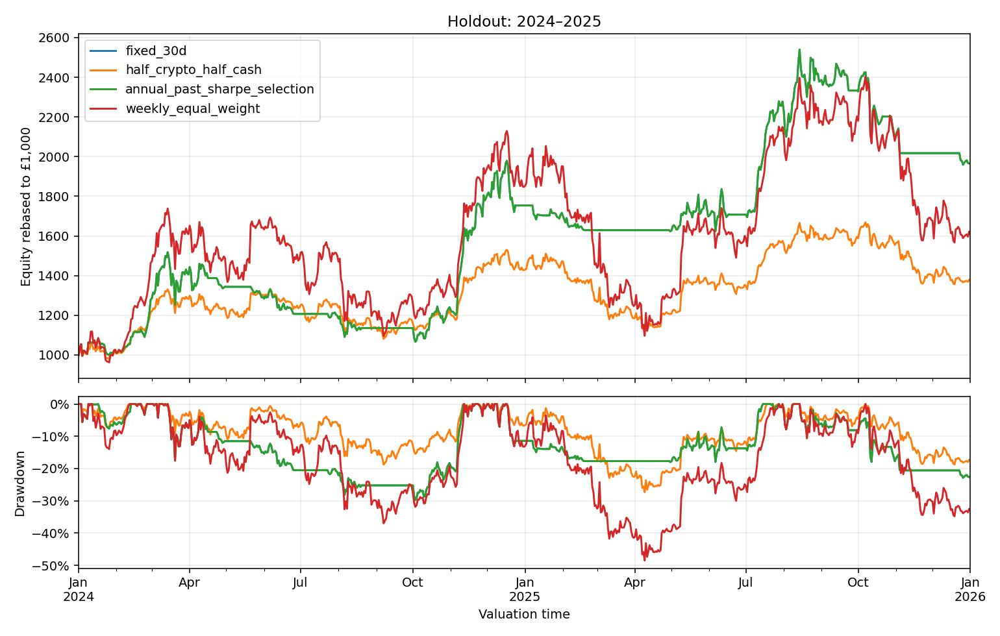

# Crypto momentum

**Strategy chosen for implementation**

The chosen 30d momentum rule, rebalancing weekly, returned 96.50% returns after modelling transaction costs during a holdout period of 2024-2025. However, the 95% confidence intervals included zero, hence no statistically significant edge over a benchmark has been shown. This does not prove that no advantage exists.

The project is limited by universe breadth, only having 2 holdout years and a lack of testing around trading frequency, all of which are set to be discussed in future projects.

## Economic hypothesis

The question we seek to find is, can a simple trend signal improve returns (and risk relative to holding crypto) compared to an equal-holding strategy with the same average cash allocation?

The hypothesis is that gradual changes in investor demand can sustain price trends, whilst bad troughs can be periods of limited crypto exposure due to the cash/crypto nature of the portfolio. This is the economic motivation behind testing, and is not a reason why this strategy must work.

## Strategy

At Monday 00:00 UTC, calculate each asset's trailing close-to-close return using completed daily candles. If said return is positive, then buy, else leave in cash. Equal weighting across both BTC, ETH. Execute the resulting targets at Tuesday's daily opening reference price. Repeat weekly. The table may make the strategy make more sense than the previous sentence.

| Signal | BTC target | ETH target | GBP cash |
| --- | ---: | ---: | ---: |
| Both trailing returns positive | 50% | 50% | 0% |
| Only BTC positive | 50% | 0% | 50% |
| Only ETH positive | 0% | 50% | 50% |
| Neither positive | 0% | 0% | 100% |

This strategy is sometimes referred to as absolute momentum. In contrary to other momentum strategies implemented in this portfolio (generally referred to as cross-sectional), they are not 'ranked', but compared against zero returns. Weights allowed to drift between rebalances

Began the project with 90d momentum, but after sweeping across 1, 3, 7, 14, 21, 30, 60, 90, 120 and 180 day momenta over the development period (with an adaptive selection over expanding folds), 30d momentum was the best performing by a vast majority of metrics, and hence was fixed for the holdout period.

## Assumptions

- History: Coinbase Exchange daily GBP candles, 01/01/2019-31/12/2025, with 2,557 observations per asset.
- Frozen snapshot: `data/raw/coinbase_history_20260915T201604_090041Z/`, comprising 22 saved requests. Request boundaries are filtered before auditing the complete daily grid, duplicates, prices and volume.
- Transaction Costs: 9 bp commission (per Revolut X rates) plus 3.5 bp other execution costs (spreading/slipping) per side, giving ~25 bp round trip. Sensitivities use 40 and 60 bp. Costs apply to net bought/sold crypto.
- Portfolio: fractional units allowed, leverage/shorting not allowed, no interest on cash, and no forced final liquidation. Holdings carry through evaluation boundaries.
- Venue limitation: Coinbase candles proxy prices are used for (intended) Revolut X execution. All transaction fees are modelling assumptions and not guaranteed. Assume all our orders are filled out at the daily open, despite available liqudity, speading/slipping, daily openings are not all guarenteed fills.

## Research design

1. Ensure saved data has no defects.
2. Compare original 90d momentum rule with buy and hold, weekly equal weight, and cash-composite benchmarks.
3. Evaluate the lookback grid over 2021–2023 (starting 03/07/2019, using expanding folds), with earlier history for signals and training.
4. Select specific lookback annually using expanding historical windows, based on net training sharpe. All training begins on 03/07/2019, with ties favouring longer lookback.
5. Evaluate frozen (30d momentum) comparision over 2024-2025, comparing with both weekly weight and 25% BTC, 25% ETH, 50% cash benchmarks
6. Estimate uncertainty using paired circular block bootstrap of daily net returns (10000 resamples, 28 day blocks, 95% confidence percentile intervals)

For an edge to be shown, the Sharpe-difference lower bound must be strictly positive, alongside a positive net strategy return. The latter was shown, but the former was not. The holdout has now been tested, so cannot be reused as a 'holdout' of a subsequent change of this type.

## Results

### Development: 2021–2023

| Strategy | Total return | CAGR | Sharpe | Maximum drawdown |
| --- | ---: | ---: | ---: | ---: |
| Fixed 30 days, chosen after exploration | 417.32% | 73.01% | 1.369 | −37.66% |
| Annual past-Sharpe selection | 106.20% | 27.30% | 0.739 | −43.18% |
| Half crypto / half cash | 88.15% | 23.47% | 0.784 | −44.99% |
| Weekly equal-weight crypto | 147.21% | 35.24% | 0.784 | −73.04% |

Annual selection chose 14, 30 and 30 days for 2021, 2022 and 2023. The hindsight winner's stronger development performance is not an independent validation result.

### Holdout: 2024–2025

| Strategy | Total return | CAGR | Annualised volatility | Sharpe | Maximum drawdown |
| --- | ---: | ---: | ---: | ---: | ---: |
| Fixed 30 days | **96.50%** | 40.15% | 33.67% | 1.170 | −29.78% |
| Half crypto / half cash | 37.59% | 17.28% | 27.36% | 0.719 | −27.32% |
| Weekly equal-weight crypto | 61.27% | 26.97% | 54.82% | 0.708 | −48.50% |

Annual selection chose 30d momentum in both holdout years. Even at 60bp round-trip, 30d momentum (rebalanced weekly) returned 87.85% over the holdout.

### Significance testing:

| Comparison against half crypto / half cash | Estimate | 95% interval, 28-day blocks |
| --- | ---: | ---: |
| Sharpe difference — primary test | +0.451 | [−0.605, +1.374] |
| Annualised mean daily return difference (exploratory) | +19.72 percentage points | [−14.02, +53.36] percentage points |
| CAGR difference (exploratory) | +22.86 percentage points | [−17.08, +90.67] percentage points |

Return-based diagnostics were added after the holdout period was tested on, with all intervals including zero (despite block-length sensitivities). Hence no significance was proven for an edge of this strategy. This does not mean that there is no edge, rather that the testing is inconclusive, despite positive results.