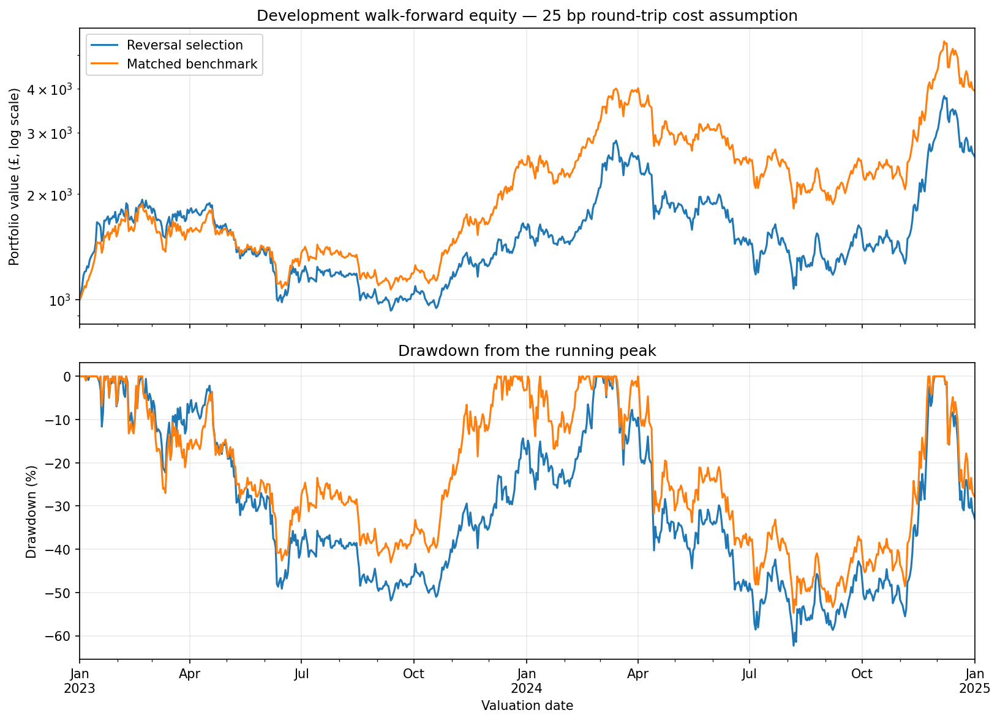

# Crypto reversal

**Strategy not chosen for implementation**

The quarterly reversal selection returned 155.57% after modelling transaction costs (25bp round trip) over the development period of 2023–2024. The matched equal-weight benchmark returned 293.46%. The strategy also had greater volatility, a lower Sharpe ratio and a worse maximum drawdown. Hence this version was stopped after development testing.

The [final notebook](notebooks/crypto_reversal.ipynb) serves as a brief overview of the [original research notebook](notebooks/archive/crypto_reversal_research_2026-09-21.ipynb), preserving the main research pattern without all the nitty-gritty details. January 2025–August 2026 was reserved for a holdout, but was not evaluated for this reversal strategy. No bootstrap significance test was run.

## Economic hypothesis

The question we seek to answer is, can buying recent relative losers improve performance compared to holding the same eligible crypto universe with equal weights?

Urgent selling can temporarily exceed buying demand, with liquidity suppliers bearing inventory and information risk. Prices may reverse as the imbalance clear, but permanent information shocks can produce losses with no reversal. An outperformance would not necessarily identify the liquidity mechanism, since it is just a recent loser signal.

## Strategy

At midnight UTC, calculate each eligible asset's trailing close-to-close return using completed daily candles. Rank the assets, select the bottom fraction and give them equal target weights. Round the number selected upwards: selecting the bottom 10% of 19 assets gives two holdings, each with a 50% target weight.

This is cross-sectional reversal. Returns are ranked against other assets, not against zero, so selected assets can have positive trailing returns. Any non-empty universe is used. If no assets qualify, hold GBP cash. Weights drift between rebalances.

The benchmark holds all assets in the same eligible universe with equal weights, following the same rebalance schedule and execution assumptions as the approach does.

Sweep across the parameters, 1, 5, 10, 30 and 90 return days, with fractions of 10%, 20% and 30%, and rebalance intervals of 1, 2, 3 and 7 calendar days. This gives 60 distinct configurations. All rebalance calendars are anchored to 01/01/2022.

## Assumptions

- Universe: saved current Revolut UK GBP candidate catalogue, matched to Coinbase USD products. Stablecoins, gold-backed tokens and the documented memecoins are excluded. Historical survivor and selection bias remain due to the current candidate list.
- History: Coinbase Exchange daily USD candles, 01/01/2019–31/08/2026, covering 59 assets before exclusions were made. Only development outcomes are evaluated here.
- Eligibility: For a cryptocurrency to be eligibie, the following is required. 181 consecutive daily observations, at least $1m median daily volume over the previous 30 days, and at most the 30 most liquid eligible cryptocurrencies. At least 20 cryptocurrencies must qualify. History restarts after gaps, inclusive of XRP's 904 missing days.
- Execution: targets are fixed at Monday midnight. Use the first common time from 00:05, with the latest completed positive-volume minute candle for each targetted cryptocurrency. Its start must be no more than five minutes old. Requirements include assets that may need selling and are shared across the development grid, so another configuration's requirements can delay execution.
- GBP valuation: divide USD prices by USD per GBP. Saved ECB rates are assumed available from the following midnight and carried through weekends. Each rate has a 7d limit.
- Transaction Costs: 9 bp commission (per Revolut X rates) plus 3.5 bp other execution costs (spreading/slipping) per side, giving ~25 bp round trip. Sensitivities use 40 and 60 bp. Costs onlyapply to net bought/sold crypto.
- Portfolio: fractional units allowed, leverage/shorting not allowed, no interest on cash, and no forced final liquidation. Holdings carry through evaluation boundaries.
- Venue limitation: Coinbase trade references and ECB exchange rates proxy GBP execution. Actual spreads, depth, fills, feed latency, order constraints and capacity remain unverified.

## Research design

1. Load saved data and audit timestamps, prices, volume and history gaps.
2. Build eligible candidates, trailing returns and target weights using data available at each decision date.
3. Sweep all 60 configurations over 2022–2024. Compare mean daily net excess against each configuration's matched benchmark, while examine consistency across years.
4. Repeat the parameter sweep with zero costs over the same period to distinguish trading-cost drag from weak relative performance.
5. Select configurations quarterly using expanding training windows. Begin with 2022 as training for 01–03 2023, then extend training before each subsequent quarter through 2024. Select the configuration with the highest mean daily net excess.
6. Apply each choice at its first anchored decision on or after the quarter starts. Run one continuous strategy and benchmark, each starting with £1,000 on 01/01/2023. There are 731 daily returns, with the last close valued on 01/01/2025.

## Results

### Development sweep: 2022–2024

Only two of the 60 configurations have positive mean daily excess after costs. The best full-period configuration uses 90 return days, selects the bottom 30% and rebalances every seven days.

| Full-period configuration | Total return | Benchmark return | Mean daily net excess | Maximum drawdown |
| --- | ---: | ---: | ---: | ---: |
| 90d / bottom 30% / every 7 days | 6.96% | 0.45% | +1.819bp | −73.25% |

No configuration has positive mean daily excess in all three development years. The full-period winner has positive excess in 2022 and 2024, but negative excess in 2023.

### Transaction costs

| Cost assumption | Configurations with positive mean daily excess |
| --- | ---: |
| Zero trading costs | 21 / 60 |
| 25bp round trip | 2 / 60 |

See that costs reduce performance considerably. However, 39 configurations underperform even with no trading costs, so costs do not explain the whole result. The zero-cost run is a test of sensitivity, not a realistic scenario.

### Development walk-forward: 2023–2024

All eight quarters select a 90-day return signal. The first two select the bottom 20% with daily rebalancing. Later quarters select the bottom 30%, generally every seven days, except 01–03 2024, which selects daily rebalancing.

| Strategy | Total return | CAGR | Annualised volatility | Sharpe | Maximum drawdown | Final equity |
| --- | ---: | ---: | ---: | ---: | ---: | ---: |
| Quarterly reversal selection | 155.57% | 59.76% | 73.22% | 1.004 | −62.30% | £2,555.73 |
| Matched equal-weight benchmark | 293.46% | 98.17% | 67.95% | 1.346 | −54.72% | £3,934.65 |

Mean daily net excess is −4.933bp. Annualised one-way turnover is 44.01 for the strategy and 8.53 for the benchmark, calculated from absolute traded notional divided by pre-trade equity.

See that the strategy makes money, but performs worse than its benchmark under every single metric above. Positive absolute returns alone do not establish an edge.

## Conclusion

The development sweep is weak across configurations and years. It produces lower returns with greater volatility, worse drawdown and more turnover than the matched benchmark. As a result, there is insufficient evidence to implement this strategy in practice

The reserved 01/2025–08/2026 holdout was not evaluated, and no bootstrap significance test was run. This is a decision to stop based on unfavourable development evidence, not a claim of statistically significant underperformance.
