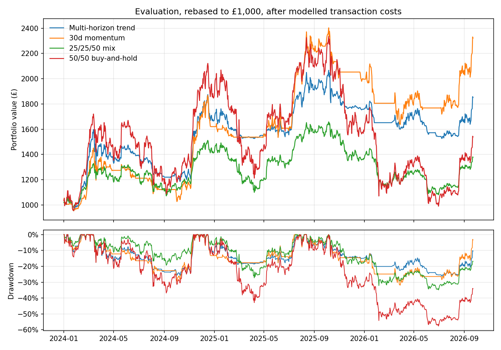

# Crypto multi-horizon trend

**Strategy not chosen for implementation**

This project effectively serves as an extension of [crypto momentum](../crypto_momentum/). Instead of the 30d lookback there, the trend signal is averaged over several lookback periods and positions are scaled by volatility. The annually selected rule returned 85.20% under the same transaction costs (25bp round trip) as opposed to 132.22% for the 30d momentum over the same period (01/2024-09/2026). It reduced max drawdown, but also Sharpe ratio, and the Sharpe difference interval contains zero, meaning no edge has been shown.

The [research notebook](notebooks/crypto_trend.ipynb) contains the key results.

## Economic hypothesis

Economic trends may persist over several lookbacks simultaenously, so taking an average measures whether the lookbacks agree with the trend, as opposed to betting all on one lookback. Volatility clusters, meaning scaling positions by volatility can reduce risk without losing out on the trend. This is a hypothesis, and not a reason why this approach will work.

## Strategy

Same universe, rebalance timing and long/cash structure as crypto momentum. The difference is the weightings, each asset has a 50% slot, scaled by the fraction of lookbacks with a positive trailing returns, then by min(1, target_vol/30d vol). Rest held in cash.

The sweep tests lookback sets {7, 14, 30, 60, 90, 180}, {14, 30, 60, 90} and {30, 60, 90, 180}, volatility targets of 40%, 60% and no cap, and bands of 0 and 10 percentage points, giving 18 distinct configurations. A configuration is chosen each January by net Sharpe excess given from all data, starting 07/2019.

## Assumptions

As crypto momentum, except:

- Execution: analogous to crypto cross-sectional. i.e, targets are fixed at Monday midnight. Use the first common time from 00:05, with the latest completed positive-volume minute candle for each targetted cryptocurrency. Always completed within the hour.
- History: Coinbase daily GBP candles 01/2019-09/2026, plus Monday minute candles for the above.
- 0% cash interest, in line with (current) Revolut X offerings.

In the original crypto_momentum project, executions occured at 00:00 UTC on Tuesday. Rerunning the same strategy, retaining every other variable apart from shifting the execution times improved the returns of that strategy in every period (456.09% vs 417.31% over 2021-2023, 99.64% vs 96.50% over 2024-2025), which are the comparisons used for the trend approach.

## Results

Over development (07/2019-2023), every configuration tested had a lower Sharpe (1.02-1.18) when compared with the 30d momentum approach (1.42), although 30d was itself chosen over that period. Annual selection mostly chose {14, 30, 60, 90} with a 60% volatility cap and a 10pp band.

### Evaluation: 01/2024-09/2026

| Strategy | Total return | CAGR | Annualised volatility | Sharpe | Maximum drawdown |
| --- | ---: | ---: | ---: | ---: | ---: |
| Multi-horizon trend | 85.20% | 25.3% | 28.4% | 0.937 | **−26.2%** |
| 30d momentum | **132.22%** | 36.2% | 32.5% | **1.110** | −31.9% |
| 25/25/50 mix | 37.84% | 12.5% | 26.8% | 0.572 | −34.9% |
| 50/50 buy-and-hold | 53.90% | 17.1% | 51.1% | 0.563 | −57.6% |

| Period | Multi-horizon trend | 30d momentum |
| --- | ---: | ---: |
| 2024 | 66.75% | 62.02% |
| 2025 | 5.50% | 23.22% |
| 01-09/2026 | 5.25% | 16.31% |

The Sharpe difference against 30d momentum is −0.174, with a 95% interval of [−0.658, +0.313] using a 28d block bootstrap approach (14d/56d sensitivities give same results). 30d momentum is the victor even with 60bp round-trip costs.

## Conclusion

Averaging lookbacks periods, and scaling using volatility did reduce drawdowns, but at the cost of too much return. This approach had generally worse Sharpe, although the significance test was insignificant. The evidence does not support using this approach instead of the currently chosen 30d momentum approach, now executed within the hour instead of the following day.
