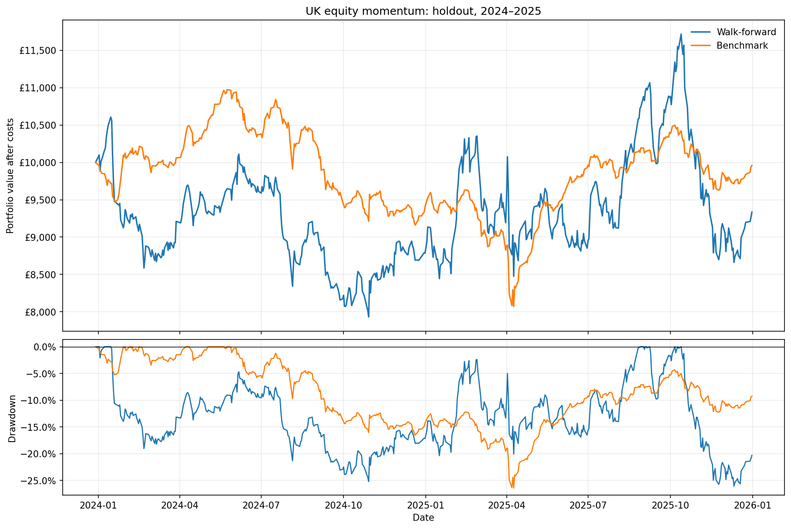

# UK equity momentum

**Strategy not chosen for implementation**

The annually selected momentum strategy returned -6.65% after modelling transaction costs over 2024–2025, compared with -0.43% for the equal-weight benchmark. Momentum had greater volatility, similar maximum drawdown and no statistically significant mean daily net excess. Hence no edge has been established against the benchmark. This does not prove that no advantage exists, but the results do not support implementing this version as a standalone strategy.

The [final notebook](notebooks/equity_momentum.ipynb) contains all the key details, while missing out the laborious details. The [original research notebook](notebooks/archive/equity_momentum_research_2026-09-22.ipynb) contains them.

## Economic hypothesis

The question we seek to answer is, can ranking shares by their past returns improve performance compared with holding the same eligible universe with equal weights?

The economic hypothesis is that gradual changes in investor demand can sustain relative price trends, so recent winners may continue to outperform their counterparts. This is the economic motivation behind testing, and is not a reason why this strategy must work.

## Strategy

After the final trading session of each month, calculate each eligible share's adjusted closing return over the past lookback days and accounting for skip days. For example, the original baseline compares the close 21 sessions ago with the close 252 sessions ago. Rank these scores, select the top 20%, and assign equal target weights. Number of selected shares is rounded upwards.

This is cross-sectional momentum. Assets are ranked against other assets, as opposed to against zero. Negative-momentum winners can still be chosen. Allow weights drift between rebalances.

The parameter sweep tests 126, 189 and 252 formation sessions, skipping either zero or 21 sessions, with top fractions of 10%, 20% and 30%. Annual selection chooses the configuration with the highest net Sharpe ratio over the previous three calendar years.

The benchmark rebalances monthly to equal weights across all common eligible shares. It uses the same timing and transaction-cost assumptions. 

## Assumptions

- Universe: Begin with 669 share candidates from a saved Trading 212 GBP/GBX catalogue. Such universe was constructed around ISA usage, avoiding FX conversion and SDRT in order to limit transaction costs. ETFs are excluded from this project. The catalogue is current, leaving historical membership and survivorship bias.
- History: free yfinance daily data from 02/01/2015–31/12/2025, covering 2,779 trading sessions. Price histories are available for 593 candidates, the rest are unavailable. GBP and pence quotes are normalised before trading.
- Eligibility: Require 60 complete sessions of liquidity observations, at least £100,000 median daily traded value, positive reported volume on at least 95% of those sessions, and a usable close with positive volume on the signal day. Each momentum window also needs complete closing history between its endpoints. All configurations rank the same eligible stocks on each date.
- Transaction costs:  Model 10bp per side on the net amount bought or sold, including entry and parameter-switching trades. Transaction costs only apply to net buys/sells.
- Portfolio: Both portfolios start with £10,000. Model 10bp per side on the net amount bought or sold, including entry and parameter-switching trades. Fractional units are allowed, with no leverage, shorting, cash interest or forced final liquidation.
- Dividends: Adjusted closes are used for signals, while trading uses GBP quotes with separate cash dividends. The quotes already use split-adjusted share basis. Dividends are credited on the previously held date after trading to previously held units, the way payment timing is approximated.
- Execution: daily opening prices are assumed fills. Bid/ask spreads, depth, order constraints and trading capacity have not been established from this data.

## Research design

1. Prepare and check the saved history, retaining explicit missing-data and suspension records.
2. Use 2015 for warm-up, then compare the original baseline and 18 parameter configurations over 2016–2021.
3. Test mean daily net excess using a paired circular block bootstrap (10,000 resamples, 63-session blocks and pointwise 95% basic confidence intervals). Use 21 and 126 block sizes as sensitivities. Apply Holm correction across the 18 configurations.
4. Evaluate annual past-Sharpe selection over 2019–2021. This remains a development diagnostic because those years were already inspected in the sweep.
5. Freeze the selection and evaluation protocol, then evaluate 2022–2023 and 2024–2025. Each period starts from £10,000 cash. The separate curves are not one continuous investment.
6. Apply the same net-excess test to each realised adaptive portfolio. Annual choices use past data, including completed evaluation years when the next training window advances.

The null is that mean daily net excess is zero or negative. Tests include transaction costs for both portfolios. Confidence intervals are not simultaneous intervals, and resampling does not repeat parameter selection or correct for the entire research history.

## Results

### Development: 2016–2021

| Strategy | Final equity | CAGR | Volatility | Sharpe | Maximum drawdown |
| --- | ---: | ---: | ---: | ---: | ---: |
| Original baseline: 252 / skip 21 / top 20% | £22,799.62 | 14.66% | 26.11% | 0.66 | -56.79% |
| Configuration 12: 252 / skip 0 / top 10% | £38,691.28 | 25.18% | 36.42% | 0.80 | -56.53% |
| Configuration 13: 252 / skip 0 / top 20% | £32,467.16 | 21.59% | 25.84% | 0.89 | -44.05% |
| Matched equal-weight benchmark | £22,717.49 | 14.59% | 18.10% | 0.84 | -53.26% |

Configurations 12 and 13 have the highest cumulative returns, but these are hindsight development winners. Only six configurations have a higher CAGR than the benchmark, and only configuration 13 has a higher Sharpe ratio. Every configuration outperforms in 2020, but every configuration underperforms in 2018 and 2021.

No configuration passes the positive-mean excess test, even before adjustment, at any tested block length. The primary one-sided p-values for configurations 12 and 13 are 0.1221 and 0.1276. All Holm-adjusted p-values equal 1.

### Annual selection

| Trading year | Training years | Configuration | Formation sessions | Skipped sessions | Top fraction |
| --- | --- | ---: | ---: | ---: | ---: |
| 2019 | 2016–2018 | 12 | 252 | 0 | 10% |
| 2020 | 2017–2019 | 11 | 189 | 21 | 30% |
| 2021 | 2018–2020 | 13 | 252 | 0 | 20% |
| 2022 | 2019–2021 | 13 | 252 | 0 | 20% |
| 2023 | 2020–2022 | 15 | 252 | 21 | 10% |
| 2024 | 2021–2023 | 15 | 252 | 21 | 10% |
| 2025 | 2022–2024 | 9 | 189 | 21 | 10% |

The development walk-forward ends at £16,391.45 over 2019–2021, compared with £17,806.17 for the benchmark. Outperformance in 2019 and 2020 is removed by an underperformance in 2021.

### Validation and holdout

| Period | Portfolio | Final equity | Total return | Volatility | Sharpe | Maximum drawdown |
| --- | --- | ---: | ---: | ---: | ---: | ---: |
| 2022–2023 | Annual momentum selection | £8,295.28 | -17.05% | 24.69% | -0.26 | -39.60% |
| 2022–2023 | Matched benchmark | £6,980.66 | -30.19% | 14.90% | -1.14 | -37.66% |
| 2024–2025 | Annual momentum selection | £9,335.05 | -6.65% | 25.46% | -0.01 | -26.05% |
| 2024–2025 | Matched benchmark | £9,957.13 | -0.43% | 11.73% | 0.04 | -26.43% |

Momentum outperforms in both validation years, but both portfolios lose money over the period. It then underperforms by 6.24% in 2024 and outperforms by only 0.43% in 2025. The upward spikes do not become a sustained cumulative advantage.

In the holdout, annual two-way turnover is 9.00 times capital for momentum, versus 3.17 for the benchmark. Modelled trading costs total £169.52 and £62.92 respectively. Turnover counts both purchases and sales.

### Significance testing

| Evaluation | Block length | Mean daily net excess | 95% interval | One-sided p-value |
| --- | ---: | ---: | ---: | ---: |
| 2022–2023 | 63 sessions, primary | +4.213bp | [-5.979, +13.939]bp | 0.2128 |
| 2022–2023 | 21 sessions | +4.213bp | [-5.265, +12.958]bp | 0.1723 |
| 2022–2023 | 126 sessions | +4.213bp | [-6.772, +13.797]bp | 0.2170 |
| 2024–2025 | 63 sessions, primary | -0.258bp | [-10.661, +9.892]bp | 0.5141 |
| 2024–2025 | 21 sessions | -0.258bp | [-13.034, +12.389]bp | 0.5206 |
| 2024–2025 | 126 sessions | -0.258bp | [-9.283, +8.503]bp | 0.5182 |

All intervals contain zero. Neither evaluation rejects the null. There is only one adaptive strategy in each evaluation, so its Holm-adjusted p-value is the same as its unadjusted value.

## Conclusion

The baseline offers little improvement over the benchmark, and the strongest development configurations do not maintain a consistent advantage under annual selection. Momentum loses less in validation but performs worse in the holdout, with greater volatility in both periods. The significance tests do not establish an edge, although this does not mean an edge does not exist. The lacklustre results of this approach mean that it is unlikely to be used in the future.

