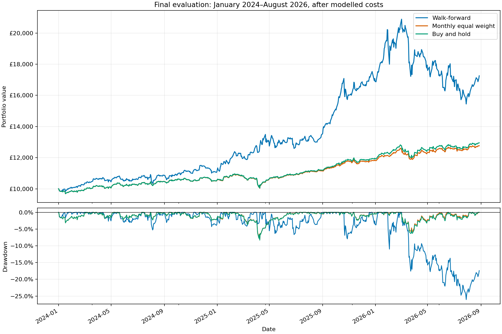

# ETF relative momentum

**Not selected for implementation**

Annually selected momentum strategy returns £17,254.97 from £10,000 over 01/2024-08/2026, compared with £12,766.26 for its equal weight, rebalanced monthly, benchmark. However, near enough all of the net profit comes from gold, volatility is increased substantially, and its mean daily net excess does not pass a 5% significance test. The approach also underperformed in earlier development/walk-forward periods, and there is insufficient evidence to support implementing the stratregy alone.

The [final notebook](notebooks/etf_relative_momentum.ipynb) contains the key details, while the [original research notebook](notebooks/archive/etf_relative_momentum_research_2026-09-24.ipynb) contains all nitty-gritty details.

## Economic hypothesis

The question we seek to answer is, can ranking shares by their past returns improve performance compared with holding the same eligible universe with equal weights?

The economic hypothesis is that gradual changes in investor demand can sustain relative price trends, so recent winners may continue to outperform their counterparts. This is the economic motivation behind testing, and is not a reason why this strategy must work.

## Universe and strategy

The used universe contains 20 GBP/GBX listings from the Trading 212 catalogue. They were chosen to broaden our exposure to different economic markets, and avoid FX and SDRT fees. It is a current universe, and hence experiences survivorship bias.

| Exposure | Tickers |
| --- | --- |
| Regional equities and smaller companies | IUSA, ISF, IEUX, IJPN, IEEM, CPJ1, MIDD, WLDS |
| UK government bonds: short, broad, long and inflation-linked | IGLS, IGLT, GLTL, INXG |
| Overseas government bonds, GBP hedged | IGTM, XGSG |
| Sterling and GBP-hedged corporate bonds | SLXX, CRHG, GHYS |
| Listed property | IWDP |
| Physical gold ETC | SGLN |
| Broad commodity futures | CMOP |

At the end of each month's final close, calculate adjusted returns over the lookback months. Rank all eligible assets by this, select the top N of them, and assign equal target weights. Complete the rebalance at the following open, while allowing weights to drift between rebalances. If equal scores, the tie breaker is alphabetical order.

This is a relative momentum approach and winners can have negative returns. There is not a cash filter when returns are negative. Even though all listing are GBP, exposure to other currencies exists through the assets being traded

Original baseline used 12 month lookbacks and top 3 assets. Parameter sweep involved 3, 6, 9, 12 month lookbacks, with 1, 3, 5, 8 selected assets. The eligibilty mask of requiring 12 months closing history remains constant throughout. Annual selection is done using net Sharpe over the past 3 complete calendar years, with ties broken by configuration ID

## Assumptions

- Data: yfinance raw/repaired daily histories, aligning to LSE schedule from 2015 onwards. Gaps remain missing and are not covered in, and survivorship bias remains
- Returns: adjusted closes provide the signals, with adjusted opening and closing prices giving the return proxy for the portfolio. Dividends are already embedded in the prices, so aren't credited again.
- Quote gaps: reviewed IJPN, WLDS and CMOP observations on 24 October 2025 are excluded. The prior close supplies that day's valuation only.  Daily risk measurements around these marks remain estimates. It is not a rebalance or signal date, so calculations remain unchanged.
- Portfolio: each evaluation begins with £10,000. Fractional units are allowed, with no leverage, shorting, cash interest or forced final liquidation. Portfolio continuity across year boundaries.
- Costs: model transaction fees using 10bp costs each side on net traded assets, including entry. There is no cost sensitivity tested here, due to the relatively poor results obtained
- Execution: daily opens are assumed fills. Bid/ask quotes, depth, order constraints and trading capacity are not established by these histories.

Primary benchmark rebalances monthly to equal weights across all eligible assets in the universe, while paying proportional transaction fees. Context benchmark buys at equal weights, and allows weight to drift without rebalancing.

## Research design

1. Use 2015 for warm-up. Evaluate baseline and 16 distinct fixed configurations from 02/2016-2021.
2. Test daily mean net excess over the benchmark using a block bootstrap approach (10000 resamples, 63 trading day block sizes, 95% confidence interval). Apply Holm correction to the 16 configurations.
3. Select specific configuration annually using the three preceding calendar years, selecting by net Sharpe. First window is 2017-2019, which gives the 2020-2021 testing configuration
4. Continue to evaluate using the annual selection rule over 2022-2023 and 01/2024-08/2026. Each period starts afresh with £10,000, not a continuous investment. Evaluation years are used as training data for subsequent years
5. Analyse the split of the final evaluation period's profit, and test the net excess of the strategy against the primary benchmark

These periods are not wholly unseen across the wider research history.

## Results

### Development

Over 02/2016–2021, original baseline ends at £14,152.64, below the monthly benchmark at £15,743.03 and 'buy and hold' at £15,973.30. No swept configuration has a higher Sharpe ratio than the monthly benchmark.

Configuration 9, using 9 lookback months and the top 3, has the highest development CAGR at 9.19%. However, no configuration passes the mean net excess significance test even before correction. The smallest one-sided p-value is 0.2973, and every Holm-adjusted value is 1.

### Annual selection

| Trading year | Training years | Configuration | Lookback months | Top N |
| --- | --- | ---: | ---: | ---: |
| 2020 | 2017–2019 | 0 | 3 | 1 |
| 2021 | 2018–2020 | 0 | 3 | 1 |
| 2022 | 2019–2021 | 3 | 3 | 8 |
| 2023 | 2020–2022 | 9 | 9 | 3 |
| 2024 | 2021–2023 | 14 | 12 | 5 |
| 2025 | 2022–2024 | 8 | 9 | 1 |
| 2026 | 2023–2025 | 8 | 9 | 1 |

| Period | Portfolio | Final equity | CAGR | Volatility | Sharpe | Maximum drawdown |
| --- | --- | ---: | ---: | ---: | ---: | ---: |
| 2020–2021 | Walk-forward | £10,731.47 | 3.60% | 16.86% | 0.29 | -16.19% |
| 2020–2021 | Monthly equal weight | £11,196.99 | 5.82% | 9.97% | 0.61 | -18.07% |
| 2020–2021 | Buy and hold | £11,250.21 | 6.07% | 9.79% | 0.65 | -17.60% |
| 2022–2023 | Walk-forward | £8,982.83 | -5.26% | 10.50% | -0.46 | -15.76% |
| 2022–2023 | Monthly equal weight | £9,441.48 | -2.85% | 8.16% | -0.31 | -15.87% |
| 2022–2023 | Buy and hold | £9,477.51 | -2.67% | 7.87% | -0.30 | -14.65% |
| Jan 2024–Aug 2026 | Walk-forward | £17,254.97 | 22.80% | 18.76% | 1.18 | -26.06% |
| Jan 2024–Aug 2026 | Monthly equal weight | £12,766.26 | 9.63% | 6.58% | 1.42 | -8.24% |
| Jan 2024–Aug 2026 | Buy and hold | £12,953.53 | 10.23% | 6.86% | 1.45 | -8.31% |

Our approach loses the lead it holds early in the development period near the end of 2021, before underperforming in the validation period. The performance is much better in the final period, although it comes with greater volatility, worse drawdown, and a lower Sharpe when compared with both both benchmarks. Transacations costs in the final period total £178.84 for momentum, £16.32 for monthly equal weight and £9.99 for buy and hold.

### Gold concentration and significance

In the final period, gold contributes £7,224.43 of the final strategy's £7,254.97 net profit, or 99.58%, with the strategy targeting 100% gold throughout all of 2025 and the first 4 months of 2026. Other assets profits and losses effectively cancel. The strategy managed to identify a sustained winner, but this does not establish repeatable success across different exposure areas

| Final evaluation test | Result |
| --- | ---: |
| Mean daily net excess over monthly equal weight | +5.088bp |
| 95% interval | [-2.420, +13.093]bp |
| One-sided p-value | 0.0943 |
| Reject zero-or-negative mean excess at 5% | No |

Transaction costs are included in each portfolio. Since there is only one adaptive strategy in this period, the Holm adjusted value is the same as the standard p-value. Failure to reject does not meant that no edge exists.

## Conclusion

The evidence above does not support implementing this strategy in action. The strategy performs poorly in development and the earlier evaluation period, and even though the final period performed well, it depends almost entirely on gold, and carries noticeably more risk. Whether these net returns add value alongside other strategies remains untested.

