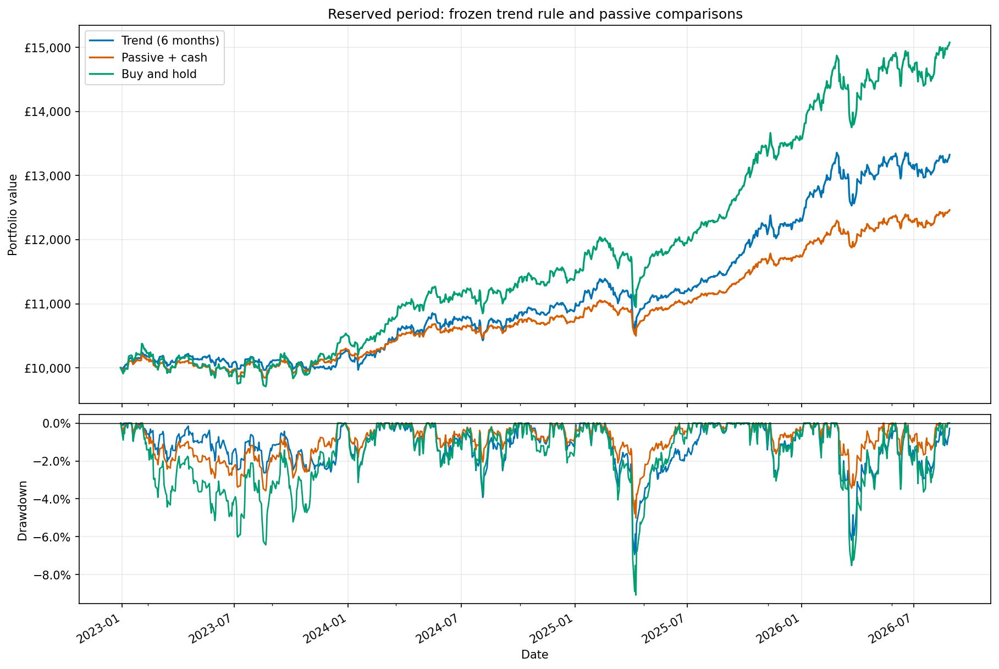

# ETF trend

**Strategy not chosen for implementation**

A monthly long/cash trend study across ten GBP equities with a variety of exposures, using free daily price history and modelled transaction costs.

The six-month rule outperformed a fixed cash-composite benchmark in the holdout period, with a borderline one-sided significance result. It also took more risk. A fully invested, initially equal weight, buy and hold approach produced a higher return albeit with larger drawdowns.

The [research notebook](notebooks/etf_trend.ipynb) serves as a concise summary of exploratory work done in this project, which can be found [here](notebooks/archive/etf_trend_research_2026_09_16.ipynb)

## Economic hypothesis

Gradual investor response to information, alongside persistent investment flows may cause sustained trends across different equities. A long/cash strategy could reduce exposure during prolonged declines, while contribuiting during upturns, but late exits and missed recoveries could offset that theoretical benefit

The motivation comes from [time-series momentum research](https://www.aqr.com/Insights/Research/Journal-Article/Time-Series-Momentum), but we do not implement its futures/forwards strategy.

## Universe and rule

| London ticker | Exposure |
| --- | --- |
| IUSA | US equities |
| ISF | UK equities |
| IEUX | European equities (excl. UK) |
| IJPN | Japanese equities |
| IEEM | Emerging-market equities |
| IGLT | UK conventional gilts |
| INXG | UK inflation-linked gilts |
| SLXX | Sterling corporate bonds |
| SGLN | Physical gold ETC |
| CMOP | Broad commodity futures ETF |

Universe was chosen from (present-day) Trading 212 choices, and are designed to provide broad equity, bond and commodity exposure whilst avoiding FX fees. GBP listing does not eliminate the currency exposure of the assets bought. Also, 5 ETF's and 3 bond funds have overlapping risk, with this strategy not being risk parity.

At each month-end close, calculate each asset's adjusted price return over the chosen lookback. Allocate 10% to each asset with a positive return, and leave negative return allocations in cash. Rebalances occur at the following open, with weights being allowed to drift between rebalances.

Original lookback was 12 months, with development comparing 3, 6, 9 and 12 months, with 6 months being selected due to highest CAGR and smallest drawdown.

## Research design

- Common history: 10/04/2017, beginning at CMOP's listing date. All development candidates retain the original 12-month warm-up
- Development:  01/05/2018–30/12/2022, with 1,180 trading sessions and 56 monthly rebalances.
- Holdout: 03/01/2023–28/08/2026, with 925 trading sessions and 44 monthly rebalances. Both portfolios start afresh with £10,000.
- Primary benchmark: monthly equal-weight exposure to the same ten assets, with 55.67% invested and 44.33% cash. The invested fraction comes from the ratio of the 6 month strategy's volatility to fully invested monthly-basket volatility over the development period. This is fixed during the holdout period.
- Contextual benchmark: fully invested buy and hold approach, initially 10% each and then left to drift. Its holdout period comparison was added after the primary results were inspected and does not replace the primary statistical benchmark.

The holdout period is now inspected and cannot serve as untouched evidence for subsequent rule changes.

## Results

All results below start from £10,000 and include 10bp transaction costs per side, zero cash interest and no forced final liquidation.

| Reserved-period portfolio | Final value | Total return | CAGR | Annualised volatility | Maximum drawdown |
| --- | ---: | ---: | ---: | ---: | ---: |
| Six-month trend | £13,325.30 | 33.25% | 8.18% | 6.10% | −6.95% |
| Passive + cash | £12,462.23 | 24.62% | 6.21% | 4.16% | −5.01% |
| Buy-and-hold | £15,077.45 | 50.77% | 11.90% | 8.00% | −9.09% |

Trend's average cash allocation was 26.99%, compared with 44.24% for the primary benchmark. Its larger return therefore comes with noticable difference in exposure. These results do not establish a risk-adjusted advantage from the strategy.

### Uncertainty and costs

The primary statistic is mean monthly net (strategy - benchmark) return. Each portfolio's daily returns are compounded into months before subtraction. A paired circular block bootstrap uses three-month blocks and 10,000 samples. Difference is centred under a zero-mean null hypothesis, with the output including 1-sided p-values and a 2-sided 95% confidence interval. See the [time-series bootstrap reference](https://bashtage.github.io/arch/bootstrap/timeseries-bootstraps.html) and [interval construction](https://bashtage.github.io/arch/bootstrap/confidence-intervals.html) for more information.

| Cost per traded side | Trend final value | Passive/cash final value | Mean monthly net excess | Two-sided 95% interval | One-sided p-value |
| --- | ---: | ---: | ---: | ---: | ---: |
| 5 bp | £13,382.19 | £12,468.88 | 16.93 bp | [−1.70, 33.58] bp | 0.0364 |
| 10 bp (primary) | £13,325.30 | £12,462.23 | 16.08 bp | [−2.67, 32.84] bp | 0.0448 |
| 20 bp | £13,212.23 | £12,448.96 | 14.37 bp | [−4.64, 31.35] bp | 0.0670 |

The primary 1-sided test does narrowly produce a signficant p-value, while all two-sided intervals include zero. Positive excess is consistent across transaction costs, but the significance label does not.

## Data and execution limits

- Free data: the study retains raw and repaired yfinance caches. Raw equity dividend adjustments showed scaling problems between GBP and GBp, with repaired histories being internally more consistent, but not independently audited. Retrospective repairs are not point in time data. [Repair documentation](https://ranaroussi.github.io/yfinance/advanced/price_repair.html).
- Reviewed gaps: IJPN and CMOP quotes on 24 October 2025 are excluded. Instead, the preceding sessions adjusted closes have been used to supply valuation marks only. Neither gap is a signal date, nor a rebalance date, so monthly endpoints are conserved, but nearby volatility/drawdown are approximations
- Price and dividend accounting: adjusted opens are `Open × Adj Close / Close`. Dividends are not credited separately, with these already being embedded by fractional units Fund expenses already reflected in prices are not deducted again.
- Rebalacing: Buy/sell transaction costs occur only on net traded assets, including initial purchase. Daily opens plus fixed friction are assumed fills. Spreading and other transaction fees have not been explicitly measured, but are included in our modelling of transaction costs.
- Cash and portfolio scope: All cash is modelled with zero interest. There is no leverage, shorting, volatility targeting or operational broker integration. Final holdings are marked at the close without an exit trade.
- Evidence: a current ten asset universe with correlated exposures. Only 44 holdout months and the sensitivity to block lengths limit the quality of evidence. Positive returns do not necessarily identify the proposed economic motivation.

## Conclusion

The six month strategy reduced risk relative to a standard buy and hold approach, but at the cost of return. It outperformed a cash-composite benchmark, but also took on more risk and exposure. This evidence does not justify using this strategy in practice.
