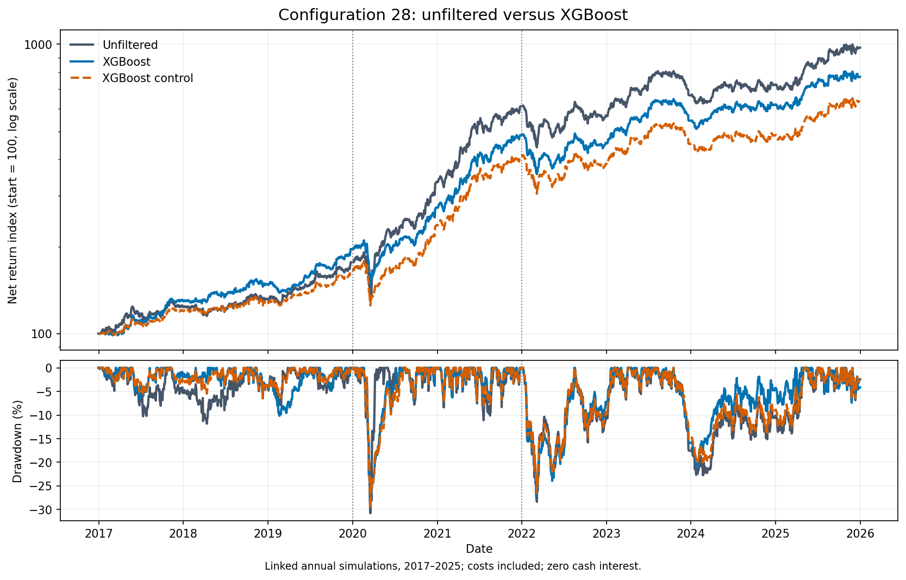

# Reversal signals

**Strategy chosen for implementation**

The final approach concluded is the raw-reversal score selector with a cap of 5% on each target allocation. Unused allocations remain in cash. There is not a trading edge concluded here, but there is consistently positive results against a benchmark.

The [final notebook](notebooks/reversal_signals_uk.ipynb) collates a lot of the useful data for analysis. It runs the 2024–2025 evaluation, concentration diagnostics and risk comparison. The [complete research archive](notebooks/archive/reversal_signals_uk_research_2026_09_15.ipynb) retains the development sweep, earlier walk-forward and holdout results, alongside individual event investigations.

## Economic hypothesis

Urgent selling can temporarily exceed buying demand, with liquidity suppliers bearing inventory and information risk. Prices may reverse as the imbalance clear, but permanent information shocks can produce losses with no reversal. An outperformance would not necessarily identify the liquidity mechanism, since it is just a recent loser signal.

## Final results

Final run starts with £10,000 at the final 2023 session close and ends on 31st December 2025. Results include 10bp transaction costs per side, and fixed 3.8% AER interest on cash per current Trading 212 rates.

| Variant | Final equity | Total return | Maximum drawdown | One-sided p: benchmark excess |
|---|---:|---:|---:|---:|
| Original | £12,721.08 | 27.21% | −18.83% | 0.1888 |
| 5% target cap | £12,540.17 | 25.40% | −12.84% | 0.1781 |
| Drawdown rule | £10,906.19 | 9.06% | −25.24% | 0.2884 |

The capped benchmark ends at £10,484.55, cash-only scenario ends at £10,777.19. The cap's mean daily net matched-benchmark excess is 4.074 bps, with a pointwise 95% interval of [−4.581, 12.729] bps. Its unadjusted p-values against cash and zero return are 0.2114 and 0.1304. None of the nine final tests pass even before adjustment, with all Holm-adjusted p-values equalling 1.

The cap improved the risk-return ratio, but have not established a clear trading edge statistically from its benchmark. The 3 risk approaches were tested against their matched benchmarks, cash interest, and zero using 507 trading days and HAC testing/Holm adjustment. Risk choices were made after testing, and do not account for the entire research history

2017-2021 development walk-forward had mean daily excess 21.120 and p ≈ 0.00001075. The 2022-2023 had much smaller estimates at 6.187bps excess. The sample data was slightly different due to yfinance limitations in data, with the former result not being replicated on the corrected history.

## Model and limitations

- Current universe dataset declares 646 possible candidates, but only 573 are available (73 unavailable). Also, historical membership, and data for delisted assets are unavailable to us.
- Eligibility uses 60 (trading) day liquidity history, a £100,000 median traded-value proxy, zero volume and formation history checks.
- 36 configurations use expanding training, with 504 initial sessions and 63 session tests. Configuration 27 (top 10% of stocks when ranked by raw-reversal score rebalanced daily) is chosen by each fold. 
- Signals are formed at close on trading day t, and executed on trading day t+1, and are also netted before modelling transaction costs (10bp per side) are applied. Opening prices are assumed fills and have not been verified as bid/ask quotes.
- 5% cap applies to the target budgets against the trading equity. The excess is left in cash and does not guarentee that realised position weights remain below 5% after price changes.
- Each benchmark rebalance eligible stocks at the matching planned exposure, not market indices.
- Cash interest is compounded each day with a 365.25-day basis. 3.8% is not a historical interest rate, but has been used due to it being the current rate. Fractional-penny rounding approximations are used for this interest. Dividends remain reserved without reinvestment, and are not subject to interest due to the exact dates being unavailable

# Machine-learning extension

**The walk-forward ML version kept for further testing, alongside one fixed candidate**

The [ML notebook](notebooks/reversal_signals_ml.ipynb) compares Ridge and XGBoost filters with the same unfiltered reversal configurations and exposure-matched controls. The [research archive](notebooks/archive/reversal_signals_ml_research_2026-09-28.ipynb) preserves the main details

## Economic hypothesis

A recent price fall can reflect temporary selling pressure mentioned above, or just constant repricing of the asset. Past returns, volatility, relative volume and the movement of other eligible shares could distinguish these situations. The model forecasts each proposed asset's return over the holding period, and retains its allocation only when that forecast is positive. Rejected allocations remain in cash.

## Fixed-configuration results

The configuration kept is the following: 10 session reversal score, top 10%, rebalance every 3 trading days. XGBoost is applied to the previous year of data. Results include modelled transaction fees, but no interest on cash holdings

| Variant | Linked return | Net Sharpe | Annualised volatility | Maximum drawdown |
|---|---:|---:|---:|---:|
| Unfiltered 28 | 874.39% | 1.337 | 20.45% | −30.79% |
| XGBoost 28 | 672.05% | 1.357 | 17.88% | −29.37% |
| Exposure control | 536.30% | 1.273 | 17.30% | −29.66% |

Filtering with our ML model reduces returns and volatility, but does increase Sharpe. A large amount of the gap in returns comes from the 2020 economic rebound, with 89.34% vs 38.98%. Over 2022-2025, returns are 59.48% compared with 58.78% respectively. The Sharpe difference has not been established as a statistical edge.

## Continuous walk-forward results

Both approaches use configurations selected every 63 trading days using expanding daily mean net excess over their respective benchmarks. Candidate rankings use uncapped, no cash interest, but final portfolios use capped targets and 3.8% interest. Two continuous holdings from 22/03/19-31/12/25, starting with £10,000

| Variant | Final equity | Total return | Maximum drawdown |
|---|---:|---:|---:|
| Unfiltered selector | £58,403.75 | 484.04% | −32.02% |
| XGBoost selector | £43,118.21 | 331.18% | −29.31% |

The filter approach improves in later years, but loses massively in 2020-2021 economic rebound. Changes are both filtering and configuration selection, so does not isolate the filter's contribution alone.

## Model and limitations

- The following features are trained on: raw reversal score, 1, 20 trading day returns, 20 trading day volatility, relative volume and the eligible universe's daily return. Only outcomes observable before fitting are used as training data
- Ridge uses standardisation and alpha 1. XGBoost uses 100 depth two trees, learning rate 0.05, minimum child weight 50 and L2 regularisation 10. Settings and the zero forecast threshold remain fixed.
- Forecasts target gross open-to-open returns including dividends. Positive predictions need not cover costs, just be strictly positive.
- Costs remain 10 bp per side. This may be too low, but is set to undergo further testing when more information is known. The benchmark matches target exposure without selecting stocks. Continuous portfolios carry positions across refits, despite the potential changing of configurations

## Conclusion

Neither the signal, nor its ML counterpart, showed a statistical edge over their corresponding benchmarks, despite encouraging return and Sharpe results. This approach is retained for further testing.
